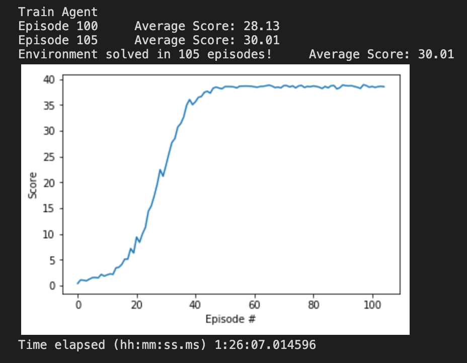

<!-- s -->

# Technical Report

## Learning Algorithm
The project implements Deep Deterministic Policy Gradients to solve the [Reacher](https://github.com/Unity-Technologies/ml-agents/blob/master/docs/Learning-Environment-Examples.md#reacher) Unity Environment. The original algorithm is described in this [paper](https://arxiv.org/abs/1509.02971).

## Hyper-parameters

| Hyper-parameter name | Value          | Detailed meaning                           |
| :---:                |:----:          | :---:                                      |
| Replay buffer size   | 1e6            | Capacity of the replay buffer              |
| Mini-batch           | 1024           | Number of samples trained in each step     |
| replay_initial       | 1024           | Initial memory before updating the network |
| update_frequency     | 2              | Update frequency for target network        |
| FC units             | (256, 128, 64) | NN hidden layers                           |
| Actor α	           | 1e-4           | Learning rate for gradient descent         |
| Critic α	           | 1e-3           | Learning rate for gradient descent         |
| weight decay         | 0              | L2 weight decay                            |
| τ                    | 1e-3           | Soft update for target network weights     |
| γ                    | 0.99           | Discount factor                            |

## Plot of Rewards
The environment was solved in 105 episodes. The final average reward converged to +38.
<figure>
    
    <!-- <figcaption>Fig 2: Rewards</figcaption> -->
</figure>

## Ideas for Future Work
The main challenge training the agent has been the instability. In the process of solving the environment, I tried MANY combinations of parameters and network architectures that resulted in a sudden drop of the reward after a variable number of episodes. It is very hard to find a correlation between the parameter choice and the agent behavior.

In the literature I found a [paper](https://cardwing.github.io/files/RL_course_report.pdf) suggesting that Prioritized Replay Buffer could improve DDPG. Other [blogs](https://medium.com/@kinwo/solving-continuous-control-environment-using-deep-deterministic-policy-gradient-ddpg-agent-5e94f82f366d) suggest the use of BatchNorm to improve convergence.